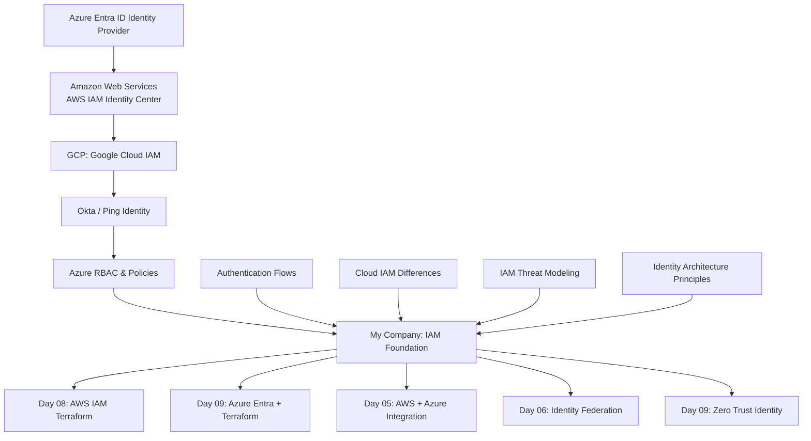

# 🟦 Day 01 — IAM Foundations & Threat Modeling

Welcome to **Day 01** of the Multi-Cloud IAM Bootcamp.  
Today sets the foundation for everything you will build in AWS, Azure, and GCP.  
By the end of this day, you will understand identity the way **cloud security architects** do.

---

## 📘 Learning Objectives

### By the end of Day 01 you will master:
- IAM vs Authentication vs Authorization  
- Identity Providers vs Service Providers  
- RBAC vs ABAC  
- Principals, Policies, and Trusts  
- Cloud IAM fundamentals across AWS, Azure, GCP  
- Threat modeling for IAM (STRIDE for identity)  
- Multi-cloud identity language and architecture  

---

# 🟩 1. Identity vs Authentication vs Authorization

### **Identity**  
“Who are you?”  
Examples:
- Azure AD user  
- AWS IAM role  
- GCP principal  
- Service account  
- Application identity  

### **Authentication**  
“How do you prove it?”  
Examples:
- Password  
- MFA  
- Certificate  
- SAML token  
- OpenID Connect token  

### **Authorization**  
“What are you allowed to do?”  
Examples:
- IAM policy  
- Role assignment  
- RBAC role  
- GCP IAM binding  

---

# 🟦 2. RBAC vs ABAC (Multi-Cloud View)

### **RBAC — Role-Based Access Control**
Permissions are grouped into *roles*.  
Examples:
- `AWSReadOnlyAccess`  
- `Azure Reader`  
- `GCP Viewer`  

### **ABAC — Attribute-Based Access Control**
Permissions depend on attributes:
- Department = Finance  
- Environment = Prod  
- DataSensitivity = High  

Cloud Examples:
- AWS IAM session tags  
- Azure Conditional Access / custom attributes  
- GCP IAM Conditions  

---

# 🟨 3. IAM Components in Each Cloud

## **AWS**
- Principals (users, roles)  
- IAM Policies  
- Permission Sets (Identity Center)  
- Trust Policies  
- Inline vs Managed policies  

## **Azure**
- Entra ID Users  
- Service Principals  
- App Registrations  
- RBAC Role Assignments  
- Conditional Access  

## **GCP**
- Principals  
- IAM Bindings  
- Service Accounts  
- IAM Conditions  

---

# 🔥 4. Hands-On Exercise  
(no cloud resources needed)

### 👉 Build an IAM Map for yourself:
Create a table like this:

| Cloud | Identity Type | Authentication | Authorization |
|-------|---------------|---------------|---------------|
| AWS | IAM Role | SAML (Azure) | Permission Set |
| Azure | User | Password + MFA | RBAC Role |
| GCP | Service Account | Key/OIDC | IAM Binding |

This table will grow over the next 10 days.

---

# 🟥 5. Threat Modeling IAM (STRIDE for Identity)

### Spoofing  
- Stolen credentials  
- Compromised service principals  
- Weak SAML trust

### Tampering  
- Token manipulation  
- Policy modification  

### Repudiation  
- Logs disabled  
- Missing CloudTrail/Entra logs  

### Information Disclosure  
- Misconfigured IAM roles  
- Open access levels  

### Denial of Service  
- Lockout via conditional access  
- IAM throttling  

### Elevation of Privilege  
- Misuse of admin roles  
- Trust policy loopholes (AWS)  
- OAuth consent phishing (Azure)

---

# 🟩 6. Diagram — IAM Foundations (Multi-Cloud)

# 🟦 7. Day 01 Summary

**You now understand:**

IAM fundamentals

Authentication flows

Cloud IAM differences

IAM threat modeling

Identity architecture language

**This foundation is required for:**

➡ Day 02 (AWS IAM + Terraform)

➡ Day 03 (Azure Entra + Terraform)

➡ Day 05 (AWS ↔ Azure Federation)

➡ Day 08 (Workload Identity Federation)

➡ Day 09 (Zero Trust Identity)

## 🔜 Next: Day 02 — AWS IAM with Terraform
