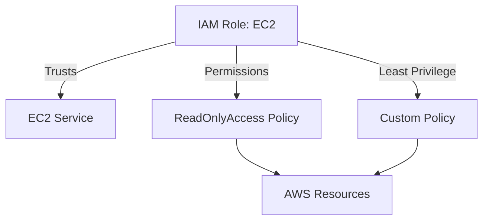
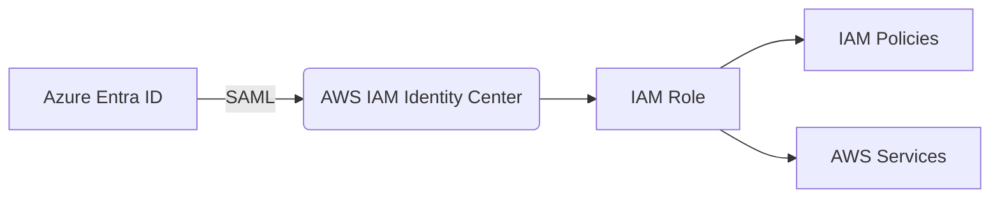

# 🟦 Day 02 — AWS IAM with Terraform

Today we begin building **AWS IAM** the way real cloud security architects do — using **Terraform** for repeatable, automated, secure deployments.

This day is critical because IAM misconfiguration is the #1 source of cloud breaches.  
By the end of Day 02, you will understand IAM deeply and automate it cleanly.

---

## 📘 Learning Objectives

You will learn:

### ✔ IAM Users, Roles, Groups (architect-level understanding)  
### ✔ IAM Trust Policies vs Permissions Policies  
### ✔ Inline vs Managed Policies  
### ✔ Terraform IAM lifecycle  
### ✔ Least Privilege & Policy Boundaries  
### ✔ AWS IAM best practices used by enterprises  
### ✔ How IAM differs from Azure AD and GCP IAM  

---

# 🟩 1. IAM Core Building Blocks (Deep Dive)

### **Principals**
- IAM users  
- IAM roles  
- Federated identities  
- AWS services (Lambda, EC2, ECS)

### **Actions**
What the identity can perform:
- `s3:GetObject`  
- `iam:PassRole`  
- `ec2:DescribeInstances`

### **Resources**
What the action applies to:
- `"arn:aws:s3:::mybucket/*"`  
- `"*"`  
- `"arn:aws:ec2:*:*:instance/*"`

### **Permissions vs Trust**
| Type | Purpose | Example |
|------|---------|---------|
| **Permissions Policy** | What the identity *can do* | `"Action": "s3:*"` |
| **Trust Policy** | Who is allowed to *assume* the role | `"Principal": { "Service": "ec2.amazonaws.com" }` |

This distinction is critical.

---

# 🟦 2. Hands-On IAM Lab (with Terraform)

Create a folder for Day 02:

Day02/
main.tf
variables.tf
outputs.tf

### `main.tf`

provider "aws" {
  region = "us-east-1"
}

# IAM Role Example
resource "aws_iam_role" "ec2_role" {
  name = "day02-ec2-role"

  assume_role_policy = jsonencode({
    Version = "2012-10-17"
    Statement = [{
      Effect = "Allow"
      Principal = {
        Service = "ec2.amazonaws.com"
      }
      Action = "sts:AssumeRole"
    }]
  })
}

# IAM Policy Attachment
resource "aws_iam_role_policy_attachment" "ec2_readonly" {
  role       = aws_iam_role.ec2_role.name
  policy_arn = "arn:aws:iam::aws:policy/ReadOnlyAccess"
}
Apply your Terraform:

bash
Copy code
terraform init
terraform apply
You just created:

✔ IAM Role
✔ Trust Policy
✔ Permission Set
✔ Role-to-Policy relationship

# 🟨 3. Least Privilege with Terraform
Replace "ReadOnlyAccess" with custom least-privilege policies:

hcl
Copy code
resource "aws_iam_policy" "least_privilege" {
  name = "day02_least_privilege"

  policy = jsonencode({
    Version = "2012-10-17"
    Statement = [
      {
        Effect = "Allow"
        Action = [
          "s3:GetObject",
          "cloudwatch:ListMetrics",
          "logs:DescribeLogGroups"
        ]
        Resource = "*"
      }
    ]
  })
}
Attach to your IAM role:

hcl
Copy code
resource "aws_iam_role_policy_attachment" "least_privilege_attach" {
  role       = aws_iam_role.ec2_role.name
  policy_arn = aws_iam_policy.least_privilege.arn
}

# 🔥 4. IAM Diagram (Mermaid)

# 🟥 5. IAM Security Best Practices (Enterprise-Level)

1️⃣ Never assign IAM permissions directly to IAM users
Always use Roles → Policies → Federated identities.

2️⃣ Prefer Federated Login (Azure → AWS SSO)
You already built this in Day 05.

3️⃣ Enforce MFA
Even on root (Day 00).

4️⃣ Use Terraform instead of console
Removes human error.

5️⃣ Policy Boundaries
Useful for limiting developer-created IAM roles.

6️⃣ IAM Access Analyzer
Use to detect dangerous trust relationships.

# 🟩 6. End-to-End IAM Flow (Foundation for Multi-Cloud)

# 🟦 7. Day 02 Summary

**You accomplished:**

✔ IAM roles with Terraform

✔ Trust vs permissions mastery

✔ Least privilege policy design

✔ Terraform IAM lifecycle

✔ Cloud-agnostic IAM understanding

**This prepares you for:**

➡ Day 03 — Azure Entra ID with Terraform

➡ Deep automation

➡ Real multi-cloud identity design

## 🔜 Next: Day 03 — Azure Entra ID with Terraform
