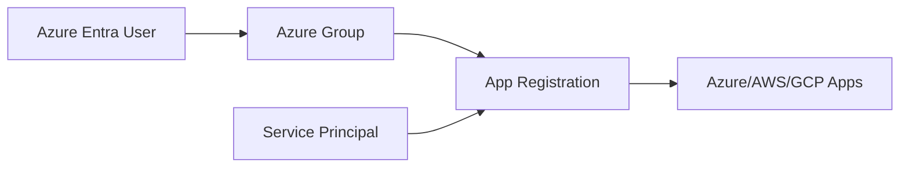

# 🟦 Day 03 — Azure Entra ID with Terraform

Day 03 brings your IAM journey to the **identity provider layer**:  
**Azure Entra ID** — the identity system that authenticates all users and applications across clouds.

Terraform will automate the identity components that normally cause cloud sprawl and misconfigurations.

This day prepares you for:
- Day 05 Federation (Azure → AWS)
- Day 08 OIDC (Azure → GCP)
- Day 09 Zero Trust Identity

Let’s go.

---

# 📘 Learning Objectives

By the end of Day 03, you will understand:

### ✔ Azure Entra ID Core Objects  
### ✔ Users vs Groups vs Service Principals  
### ✔ App Registrations (Cloud Architect Master Skill)  
### ✔ Enterprise Applications  
### ✔ Role Assignments & RBAC  
### ✔ Terraform automation for Azure Identity  
### ✔ OAuth / OIDC foundations  

---

# 🟦 1. Azure Entra Identity Building Blocks

## **Users**
Human identities:
- Cloud administrators  
- Developers  
- Operators  
- External identities (B2B users)

## **Groups**
Authorization boundaries:
- `CloudAdmins`  
- `Developers`  
- `Readers`  
- `SAML-Apps-Admins`

## **Service Principals**
Identities for:
- Applications  
- Terraform deployments  
- Workload Identity Federation  
- API integrations  

## **App Registrations**
Where your cloud apps receive:
- Client IDs  
- Secrets / certificates  
- Redirect URIs  
- Required permissions  

App registrations are the *heart* of modern cloud identity.

---

# 🟨 2. Hands-On with Terraform  
Folder layout:

Day03/
main.tf
variables.tf
outputs.tf

---

## 🟣 Create a Terraform Service Principal (App Registration)

### `main.tf`

terraform {
  required_providers {
    azuread = {
      source  = "hashicorp/azuread"
      version = "~> 2.0"
    }
  }
}

provider "azuread" {}

# Application Registration
resource "azuread_application" "terraform_app" {
  display_name = "day03-terraform-app"
}

# Service Principal
resource "azuread_service_principal" "terraform_sp" {
  application_id = azuread_application.terraform_app.application_id
}

# Client Secret
resource "azuread_application_password" "terraform_secret" {
  application_object_id = azuread_application.terraform_app.id
}
Run it:

bash
Copy code
terraform init
terraform apply
You just automated:

✔ App Registration
✔ Service Principal
✔ Secret (credential)

This is enterprise-level identity automation.

# 🟥 3. Add Directory Roles (Azure RBAC)
Assign role:

resource "azuread_directory_role" "app_admin_role" {
  display_name = "Application Administrator"
}

resource "azuread_directory_role_assignment" "assign_role" {
  role_id             = azuread_directory_role.app_admin_role.object_id
  principal_object_id = azuread_service_principal.terraform_sp.id
}
This grants your Terraform app admin rights to App Registrations.

# 🟩 4. Automate Groups & Memberships

resource "azuread_group" "cloud_admins" {
  display_name     = "Cloud-Admins"
  security_enabled = true
}

resource "azuread_group_member" "add_admin" {
  group_object_id  = azuread_group.cloud_admins.id
  member_object_id = azuread_service_principal.terraform_sp.id
}
Now your SP can manage cloud admins.

# 🟦 5. Diagram — Azure Identity Flow

# 🔥 6. Aligning Azure Identity with Multi-Cloud IAM
By now, you understand:

AWS uses:
Roles

Policies

Permission Sets

SCIM Identities

Azure uses:
Users

Groups

RBAC Roles

Service Principals

GCP uses:
IAM Bindings

Principals

Workload Identity Federation

Today’s module sets up the Azure side of your tri-cloud IAM structure.

# 🟩 7. Optional: Create OAuth Permissions (API Permissions)
Terraform example:

resource "azuread_application_required_resource_access" "graph_access" {
  application_object_id = azuread_application.terraform_app.id

  required_resource_access {
    resource_app_id = "00000003-0000-0000-c000-000000000000" # Microsoft Graph

    resource_access {
      id   = "df021288-bdef-4463-88db-98f22de89214" # Directory.ReadWrite.All
      type = "Role"
    }
  }
}
Now your Terraform SP can manage the directory.

# 🟦 8. Day 03 Summary

**You accomplished:**

✔ Terraform app registration automation

✔ Created service principals

✔ Automated secret creation

✔ Group membership automation

✔ Assigned Azure Directory Roles

✔ Built foundation for

Day 05: AWS Federation

Day 08: GCP Identity Federation

This completes the Azure side of your multi-cloud IAM architecture.

## 🔜 Next: Day 04 — GCP IAM with Terraform
