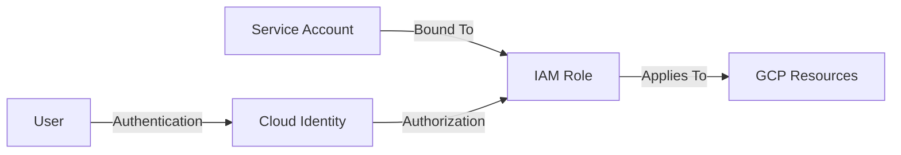

# 🟨 Day 04 — GCP IAM with Terraform

Welcome to **Day 04** of the Multi-Cloud IAM Bootcamp.  
Today you will build **Google Cloud IAM** using Terraform — completing your identity foundation across Azure, AWS, and GCP.

By the end of this day, you will understand exactly how GCP IAM differs from AWS and Azure,  
and how it fits into a multi-cloud security architecture.

---

# 📘 Learning Objectives

Today you will learn:

### ✔ GCP IAM concepts (Principals, Bindings, Roles)  
### ✔ Service Accounts (GCP’s version of application identities)  
### ✔ Custom IAM Roles vs Predefined Roles  
### ✔ IAM Bindings & Least Privilege  
### ✔ Terraform automation for GCP IAM  
### ✔ Identity handling differences vs AWS/Azure  
### ✔ Foundation for Day 08 (Workload Identity Federation)  

---

# 🟦 1. GCP IAM Concepts (Architect Level)

### **Principals**  
Identities that access GCP resources:
- Users (`user:email@gmail.com`)  
- Service Accounts (`serviceAccount:name@project.iam.gserviceaccount.com`)  
- Groups (`group:admins@example.com`)  
- External identities (via Workforce Pools)

### **Roles**  
Grouped permissions:
- Predefined roles (e.g., `roles/viewer`, `roles/storage.objectViewer`)  
- Custom roles (you define the permissions)

### **IAM Bindings**
The relationship:

Principal ← has → Role ← on → Resource

This is how every permission is granted in GCP.

---

# 🟨 2. Hands-On with Terraform (GCP IAM)

Folder structure:

Day04/
main.tf
variables.tf
outputs.tf

---

## 🟣 Terraform Provider Setup

### `main.tf`

terraform {
  required_providers {
    google = {
      source  = "hashicorp/google"
      version = "~> 5.0"
    }
  }
}

provider "google" {
  project = var.project_id
  region  = var.region
}

# 🟧 3. Create a Service Account (GCP Identity for Applications)

resource "google_service_account" "sa" {
  account_id   = "day04-serviceacct"
  display_name = "Day04 Service Account"
}
This is GCP’s version of an AWS IAM Role or Azure Service Principal.

# 🟦 4. Assign IAM Roles (IAM Bindings)
Grant Viewer permissions to the Service Account:

resource "google_project_iam_member" "viewer_binding" {
  project = var.project_id
  role    = "roles/viewer"
  member  = "serviceAccount:${google_service_account.sa.email}"
}

# 🟥 5. Create a Custom IAM Role (Least Privilege)

resource "google_project_iam_custom_role" "custom_role" {
  role_id     = "day04CustomRole"
  title       = "Day 04 Custom Role"
  description = "Example least-privilege custom role"
  permissions = [
    "resourcemanager.projects.get",
    "compute.instances.list",
    "storage.buckets.list",
  ]
}
Assign this custom role to your service account:

resource "google_project_iam_member" "custom_binding" {
  project = var.project_id
  role    = google_project_iam_custom_role.custom_role.name
  member  = "serviceAccount:${google_service_account.sa.email}"
}

# 🟩 6. Compare IAM Models Across Clouds
Concept	AWS	Azure	GCP
Identity	IAM Role / User	User / SP	User / SA
Permissions	IAM Policy	RBAC Role	IAM Role
Enforcement	Policy on Role	Role Assignment	IAM Binding
Automation	Terraform	Terraform	Terraform
Federation	SAML/OIDC	SAML/OIDC	OIDC Workforce Identity

This table becomes VERY important in Day 08 and Day 09.

# 🟦 7. Diagram — GCP IAM Flow

# 🟪 8. IAM Best Practices for GCP (Enterprise Level)

✔ Prefer Service Accounts over Users for workloads

✔ Restrict Service Account key creation

✔ Use Workload Identity Federation instead of keys (Day 08)

✔ Use IAM Conditions for least privilege

✔ Use Cloud Audit Logs to validate IAM behavior

✔ DO NOT bind Owner or Editor roles except in labs

# 🟦 9. Day 04 Summary
**Today you accomplished:**

✔ Automated GCP IAM with Terraform

✔ Created & bound Service Accounts

✔ Built custom least-privilege IAM Roles

✔ Understood multi-cloud IAM differences

✔ Prepared for Workload Identity Federation (Day 08)

You now have all three cloud IAM models under your control.

This is a major milestone.

## 🔜 Next: Day 05 — AWS ↔ Azure SAML Federation
