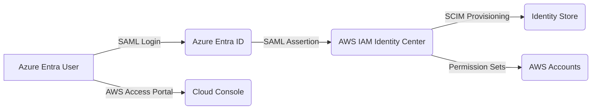

# 🟦 Day 05 — AWS ↔ Azure Entra ID Federation (SAML + SCIM)

Day 05 is one of the most important and most challenging labs in the Multi-Cloud IAM Bootcamp.  
Today you will integrate **Azure Entra ID → AWS IAM Identity Center** using:

- **SAML 2.0** (Authentication)
- **SCIM** (Provisioning)
- **Permission Sets** (Authorization)
- **Access Portal Login** (User experience)

This lab represents how **real enterprises** build identity trust across cloud boundaries.

---

# 📘 Learning Objectives

By the end of this lab, you will:

### ✔ Configure Azure Entra ID as the SAML Identity Provider for AWS  
### ✔ Configure AWS Identity Center as the Service Provider  
### ✔ Download & exchange metadata files (Azure ↔ AWS)  
### ✔ Map SAML attributes (NameID, email, UPN)  
### ✔ Enable SCIM provisioning (automatic user sync)  
### ✔ Create AWS Permission Sets (RBAC)  
### ✔ Assign a user AND successfully log in to AWS via Azure  
### ✔ Validate the SSO Access Portal tiles  

---

# 🟧 1. Architecture Overview

# 🟦 2. Create & Configure the AWS IAM Identity Center Application in Azure
Step 1 — Create the Enterprise Application
Azure Portal →
Entra ID → Enterprise Applications → + New Application → Search: "AWS IAM Identity Center"

Select:

✔ AWS IAM Identity Center (successor to AWS Single Sign-On)

Step 2 — Enable SAML SSO
Inside the app → Single Sign-On → Choose SAML

Azure will load:

Basic SAML Configuration

User Attributes & Claims

Token Signing Certificate

Service Provider metadata

Azure is now the Identity Provider (IdP).

# 🟨 3. Export AWS Metadata (SP Metadata)
In AWS Identity Center:

IAM Identity Center → Settings → SAML 2.0 Authentication → “Download metadata file”

This contains:

ACS URL

Entity ID

AWS SSO endpoints

Required SAML bindings

# 🟩 4. Upload AWS Metadata Into Azure
Back in Azure SSO:

Click Upload Metadata File (top of SAML page)

Select the AWS metadata XML.

Azure automatically fills:

✔ Identifier (Entity ID)
✔ Reply URL (ACS URL)
✔ Sign-On URL
✔ Logout URL
This avoids manual errors.

Confirm and Save.

# 🟦 5. Configure SCIM Provisioning (Automatic User Sync)
Azure → Enterprise App → Provisioning
Set:

Setting	Value
Provisioning mode	Automatic
Tenant URL	From AWS Identity Center
Secret Token	From AWS Identity Center
Provision on demand	Enabled

Click Test Connection → Expect Success.

Save settings.

Now Azure → AWS user provisioning is automated.

# 🟫 6. SAML Attribute Mapping (Required)
Azure → SSO → Attributes & Claims
Ensure:

Attribute	Value
email	user.mail
givenname	user.givenname
surname	user.surname
NameID (unique user ID)	user.userprincipalname

These values power:

SCIM sync

AWS console login

Username formatting

# 🟦 7. Import Azure IdP Metadata Into AWS
Azure SSO → SAML Certificates
Download:

✔ Federation Metadata XML
Back in AWS:

IAM Identity Center → Settings → SAML 2.0 Authentication →
Edit IdP metadata

Paste the two values from Azure metadata:

IdP sign-in URL

IdP issuer URL

Save.

AWS is now trusting Azure as the Identity Provider.

# 🟩 8. Create AWS Permission Sets (RBAC)
IAM Identity Center → Permission Sets

Create:

AWSAdmin
Policy: AdministratorAccess

AWSSecurityEngineer
Policies: SecurityAudit, CloudTrail_ReadOnly, IAMReadOnlyAccess

Inline policy for IAM report + Config read

AWSReadOnly
Policy: ReadOnlyAccess

# 🟧 9. Assign User to AWS Account & Permission Sets
IAM Identity Center → AWS Accounts → Choose your account
Click:

Assign users or groups

Assign your Azure federated user:

AWSAdmin

AWSSecurityEngineer

AWSReadOnly

AWS will generate IAM roles behind the scenes.

Provisioning status → Provisioned

# 🟦 10. VALIDATION — Login to AWS Access Portal
Open:

https://d-XXXXXXXX.awsapps.com/start
Sign in with Azure credentials.

If everything is configured correctly, you will see your AWS account tile, and under it:

✔ AWSAdmin
✔ AWSSecurityEngineer
✔ AWSReadOnly

You can now open the AWS console using Azure authentication.

# 🟩 11. Troubleshooting Notes (for real-world production)
“AADSTS700016”
Azure still has old AWS metadata.
Fix: Upload new AWS metadata again.

“This code isn’t right”
Certificate mismatch.
Fix: Ensure Azure → AWS certs are aligned.

“It’s not you, it’s us”
AWS metadata out of date.
Fix: Reimport Azure IdP metadata.

SCIM user skipped
User not assigned to Enterprise App.
Fix: Assign user → Provision on demand.

These scenarios match real enterprise troubleshooting patterns.

# 🟦 12. Day 05 Summary
**Today you:**

✔ Built cross-cloud federation (Azure → AWS)

✔ Implemented SAML 2.0 authentication

✔ Automated user provisioning with SCIM

✔ Built AWS RBAC with Permission Sets

✔ Successfully logged into AWS using Entra credentials

✔ Established the control plane for Zero Trust multi-cloud identity

This is one of the hardest identity labs — you mastered it.

## 🔜 Next: Day 06 — Terraform Remote State & Backends
